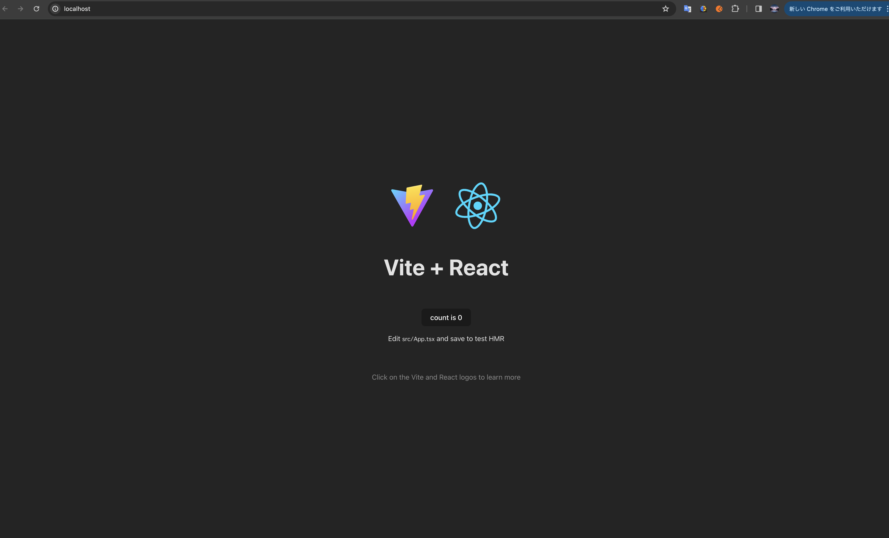

# React, Django, mysql, nginx, それぞれ Docker でコンテナ化する。

学習として、実際に作成したアプリを書き残す。

## 　使い方

SECRET_KEY には、適当なキーをセットする。

トップディレクトリにて下記のコマンドを実施。

```terminal
docker compose up -d
```

下記にアクセスする。（ポート番号 80）

http://localhost/


